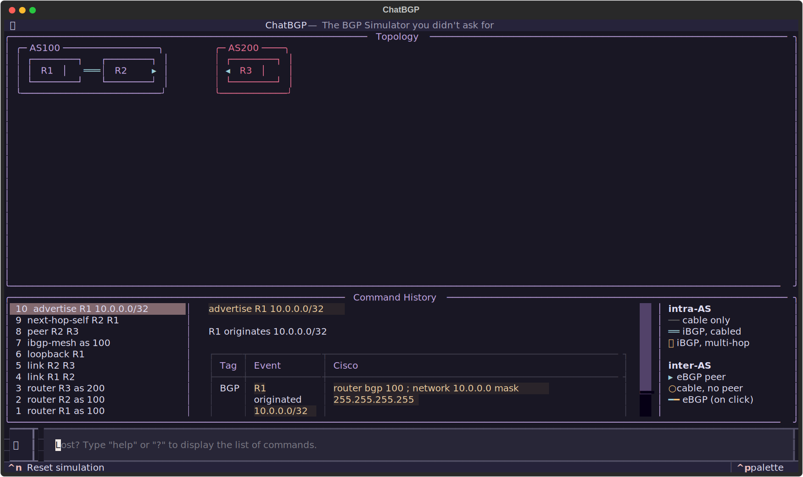
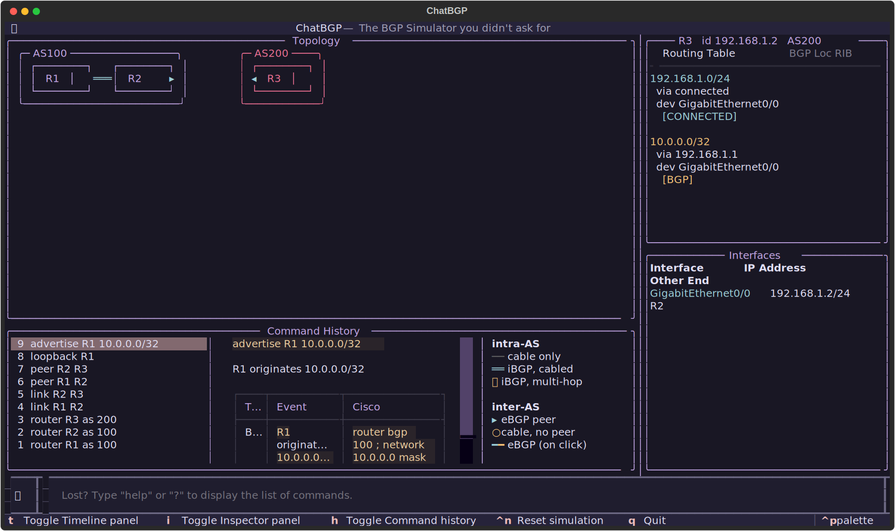

# BGP Simulator

A simple BGP Simulator written in Python. Targets networking beginners and enthusiasts, and me.

## Screenshots

## Features

- Built with [Textual](https://github.com/textualize/textual) -- fully functional TUI.
- Beginner-friendly, flat-grammar commands. Routers are called by name (`R1`),
  each command comes with a `no` prefix to reverse the action
  (`no advertise R1 10.0.0.0/24`) and short aliases to type quickly.
- **Time travel.** Events are recorded per tick (timestep), and a Timeline
  playhead lets you scrub through them: `>` advances by one step, `>>` runs to
  convergence, `<` / `<<` to go back one step and to the starting point.
  Note: the rewind is read-only, and only shows the past events. The Inspector
  panel doesn't display past states, only the current/computed tables.
  Convergence is capped at 256 ticks and warns on a possible route oscillation.
- **Cisco echo.** For each command or event, a related Cisco configuration step
  or syslog is printed for reference. For example: `neighbor <ip> remote-as <asn>`
  `network <prefix> mask <mask>`, `%LINK-3-UPDOWN`, `%BGP-6-UPDATE`, etc.
- **Responsive layout.** UI elements adapt their size to the terminal size,
  and you will be notified if there's not enough space to efficiently display
  the elements.

## Commands

Call routers by name (`R1`). Aliases are listed beside each verb; any command
undoes with the `no` prefix shown in the last column.

| Command | Set up | Undo / inverse |
| --- | --- | --- |
| `router` · `add-router` | `router <name> [as <asn>]` | `no router <R>` |
| `link` · `connect` | `link <A> <B> [cost <n>]` | `no link <A> <B>` |
| `loopback` · `lo` | `loopback <R>` | `no loopback <R> [ip]` |
| `peer` · `bgp` | `peer <A> <B>` | `no peer <A> <B>` |
| `advertise` · `adv` | `advertise <R> <prefix>/<mask>` | `no advertise <R> <prefix>` |
| `static` · `static-route` | `static <R> <prefix> <next-hop>` | `no static <R> <prefix>` |
| `ibgp-mesh` · `mesh` | `ibgp-mesh as <asn>` | `no ibgp-mesh as <asn>` |
| `next-hop-self` · `nhs` | `next-hop-self <R> <neighbor>` | `no next-hop-self <R> <neighbor>` |
| `shutdown` | `shutdown <A> <B>` | `no shutdown <A> <B>` |
| `cut` | `cut <A> <B>` | `repair <A> <B>` |
| `destroy` | `destroy <A> <B>` | `no link <A> <B>` |
| `send` · `ping` | `send <R> <dst>` | — |
| `help` · `?` | `help` | — |

Time lives on the Timeline buttons, not in the grammar: `>` step · `>>`
converge · `<` `<<` rewind. Type `help` in-app for the same table.

## Quick start

### Requirements

- `uv` installed. [Install `uv`](https://docs.astral.sh/uv/getting-started/installation/)
- Clone repo or download as ZIP and extract.
- Run `uv run main.py`.

### Recommended reading

- BGP course from NetworkLessons. [Link](https://networklessons.com/bgp/)
- BGP Fundamentals from Cisco Press. [Link](https://www.ciscopress.com/articles/article.asp?p=2756480)

## Simulation models

- `Router`: a router, have some network interfaces, routing table, and BGP data.
- `Link`: a physical connection, or a cable to connect two routers together.
- `Interface`: a physical interface, which a cable can connect to, or a virtual interface (loopback or null).
- `BGP peering session`: a two way configuration between two routers to do BGP (internal or external).

## Assumption/Abstraction

- All routers speak BGP (eBGP or iBGP full-mesh). By default, they are assigned to AS 1.
- One network consists of only two routers.
By default, creating a link will create a /24 network within `192.168.0.0/16`,
and routers will have `.1` and `.2` address.
- Loopback interfaces use `/32` subnets of `10.0.0.0/24`.
- Cisco attributes and defaults.

## Limitations

- Only IPv4 is supported.
- No redistribution since there is no other IGP.
- No import/export policies.
- No route reflectors, confederations.

## Acknowledgment

- Networklessons.com for beautifully laid out lectures about BGP basics, mechanisms, attributes, etc.
(that said, access is limited pass chapter 1, since I'm not a member).
- Claude contributes ~50% of the code, mainly including refactors, logic bug fix, realistic BGP compliance, UI, etc.

